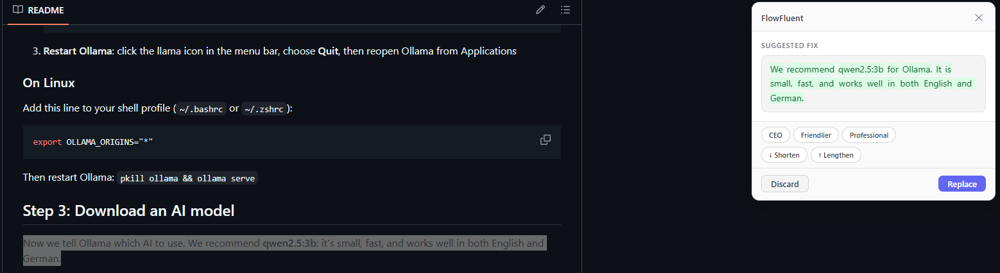
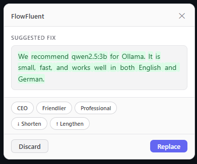
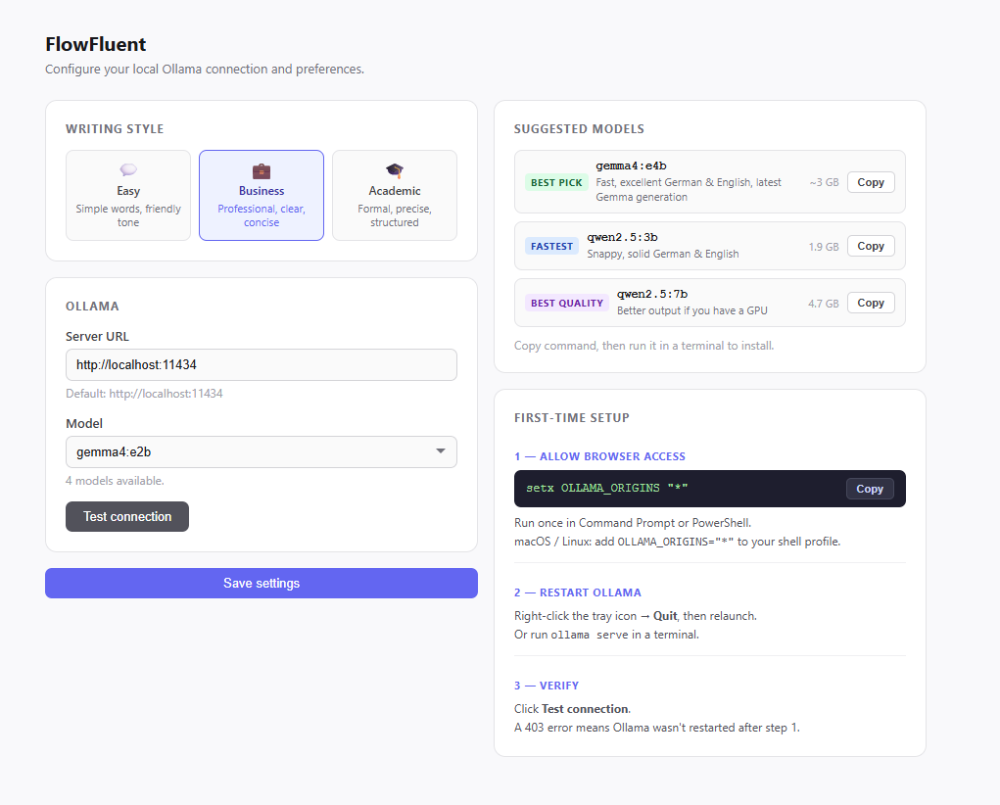

# FlowFluent

A Chrome extension that fixes your writing, rewrites it in a different tone, or translates between English and German. It runs on your own computer using a free tool called Ollama, so **nothing you write is ever sent to the internet**.





## What it does

- **Fix writing**: corrects grammar and spelling
- **Shorten / Lengthen**: makes text shorter or longer
- **Change tone**: rewrites text as a CEO, friendlier, or more professional
- **Translate**: between English and German
- Works in any text box on any website
- Shows you exactly what changed before you accept it


## Before you start

You need three things:
1. **Google Chrome** (you probably already have this)
2. **Ollama** (a free program that runs the AI on your computer)
3. **At least one Ollama model** (local or cloud)

Don't worry, the steps below walk you through each one.


## Step 1: Install Ollama

Ollama is the engine that powers FlowFluent. It's free and runs entirely on your own computer.

### On Windows
1. Go to [https://ollama.com/download](https://ollama.com/download)
2. Click the big **Download for Windows** button
3. Open the file you just downloaded (it's called `OllamaSetup.exe`)
4. Click **Install** and wait for it to finish
5. Ollama will start automatically. You'll see a small llama icon near your clock in the bottom-right corner of your screen.

### On Mac
1. Go to [https://ollama.com/download](https://ollama.com/download)
2. Click **Download for macOS**
3. Open the file you just downloaded
4. Drag the Ollama icon into your **Applications** folder
5. Open Ollama from your Applications folder
6. You'll see a llama icon in the top-right menu bar of your screen.

### On Linux
Open a terminal and paste this command:
```bash
curl -fsSL https://ollama.com/install.sh | sh
```


## Step 2: Make sure Ollama has a model

FlowFluent reads your installed model list directly from the Ollama app. You can use any model that appears in Ollama.

If you already have models installed, you can skip this step.

### Local model

We recommend **qwen3:1.7b** as a starting point: it's small, fast, and works well in both English and German.

To install it, open a terminal and run:

```bash
ollama pull qwen3:1.7b
```

### Other models you can try
| Model | Size | Best for |
|-------|------|----------|
| `qwen3:1.7b` | 1.4 GB | Fast on any computer (recommended starting point) |
| `gemma3:4b` | 3.3 GB | Better quality, still runs on most laptops |
| `qwen3:8b` | 5.2 GB | Best quality, needs a decent GPU |

FlowFluent is not limited to these models. To install another model later, run `ollama pull <name>`, then click **Refresh Ollama** in FlowFluent settings.

### Cloud model

Ollama Cloud models run through the Ollama app too. FlowFluent does not ask for an API key.

1. Open a terminal:
   - **Windows**: press the Windows key, type `cmd`, press Enter
   - **Mac**: open Terminal (`Cmd + Space`, type Terminal)
   - **Linux**: open your terminal app
2. Sign in to Ollama:
   ```bash
   ollama signin
   ```
3. Open FlowFluent settings and copy a cloud model pull command from the live catalog.
4. Run the copied command, then click **Refresh Ollama** in FlowFluent.

FlowFluent fetches the cloud model catalog from Ollama, so the list stays current without hardcoded model names.


## Step 3: Install FlowFluent in Chrome

1. Download this project as a ZIP:
   - Click the green **Code** button at the top of [this page](https://github.com/lucasbruch/FlowFluent)
   - Click **Download ZIP**
2. Unzip the file (right-click, **Extract All** on Windows; double-click on Mac)
3. Open Chrome
4. In the address bar, type `chrome://extensions` and press **Enter**
5. In the top-right corner of that page, turn on **Developer mode**
6. Click **Load unpacked** (top-left)
7. Select the folder you unzipped in step 2
8. FlowFluent now appears in your extensions list. Pin it to your toolbar by clicking the puzzle-piece icon next to your address bar, then the pin icon next to FlowFluent.


## Step 4: Choose a model

1. Click the FlowFluent icon  in your Chrome toolbar.
2. Click the gear icon to open settings.
3. FlowFluent will read installed models from Ollama.
4. Pick any installed model from the dropdown.
5. Click **Save settings**.

If no models are installed yet, use the local or cloud suggestions in settings, then click **Refresh Ollama**.


## Step 5: Try it out

1. Go to any website with a text box (like Gmail, a Google Doc, or a comment field)
2. Type a sentence with a typo, for example: `i think this is realy gud`
3. Select the sentence with your mouse
4. Right-click and choose **Fix this writing**
5. A small box appears in the top-right of the page showing the corrected text with the changes highlighted
6. Click **Replace** to put the fixed text into the text box, or **Discard** if you don't like it.



You can also try **Translate to German** or **Translate to English** from the same right-click menu.


## Settings

Click the FlowFluent icon  in your Chrome toolbar, then click the gear icon. From there you can:
- Change the writing style (Easy, Business, or Academic)
- Pick any model installed in Ollama
- Refresh the installed model list
- Copy live cloud model pull commands from Ollama's catalog




## Something went wrong?

| Problem | What to do |
|---------|------------|
| **"Cannot reach Ollama"** | Make sure Ollama is running. Check for the llama icon near your clock (Windows) or menu bar (Mac). If it's missing, open Ollama again. |
| **"Ollama blocked FlowFluent"** | Open settings, use **Init browser access** to copy the exact command for your computer, run it once, then restart Ollama. Avoid using `OLLAMA_ORIGINS="*"` unless you understand the privacy tradeoff. |
| **Model dropdown is empty** | You have not pulled a model yet. Pull any local model, or run `ollama signin` and pull a cloud model from the live catalog. |
| **Cloud model asks for sign-in** | Run `ollama signin`, then try again. FlowFluent does not store Ollama API keys. |
| **Right-click menu doesn't show "Fix this writing"** | Reload the extension: go to `chrome://extensions`, find FlowFluent, click the refresh icon. |
| **Result is slow** | Big local models are slower. Choose a smaller local model or use an Ollama Cloud model. |


## License

MIT
